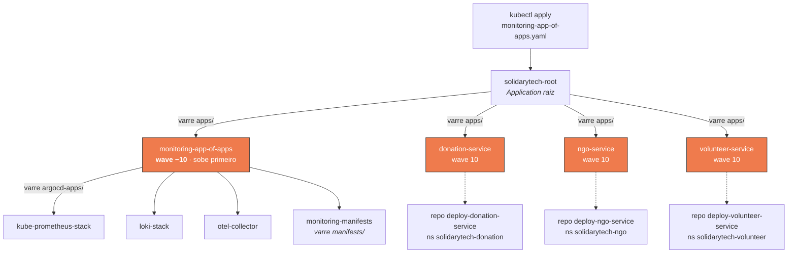
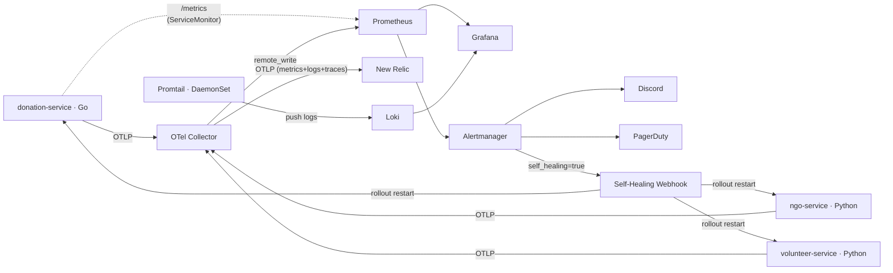
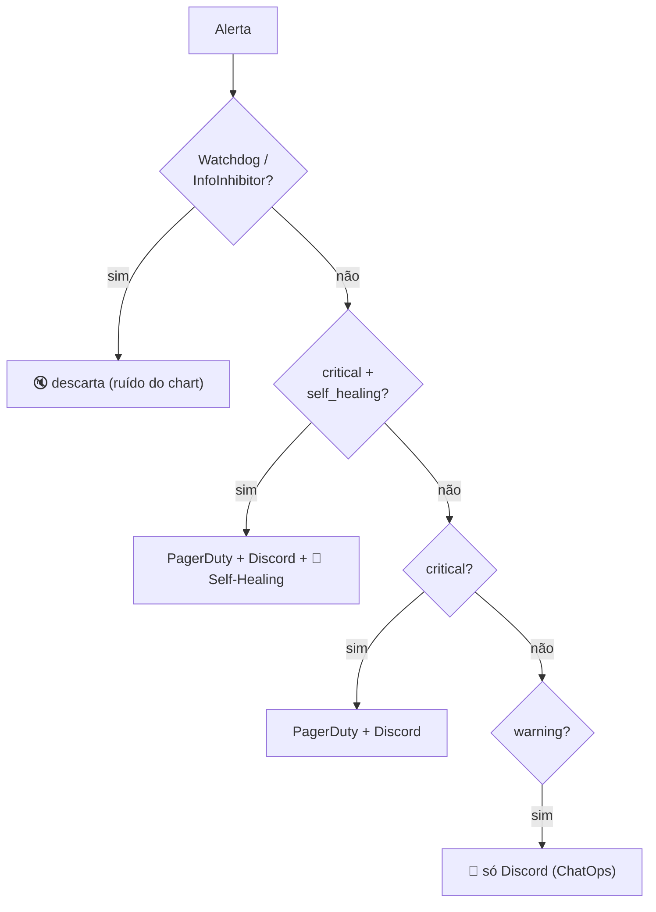

# 📊 solidarytech-monitoring-gitops

> Stack completa de observabilidade da plataforma **SolidaryTech** — **métricas, logs, traces, alertas e self-healing** — entregue por **GitOps** com Argo CD no padrão **App-of-Apps**.

---


## Sumário

- [Arquitetura GitOps (App-of-Apps)](#arquitetura-gitops-app-of-apps)
- [Componentes do stack](#componentes-do-stack)
- [Fluxo de telemetria](#fluxo-de-telemetria)
- [Alertas e roteamento](#alertas-e-roteamento)
- [Self-healing](#self-healing)
- [Segredos (External Secrets)](#segredos-external-secrets)
- [Estrutura do repositório](#estrutura-do-repositório)
- [Pré-requisitos (uma vez)](#pré-requisitos-uma-vez)
- [Deploy](#deploy)
- [Verificação](#verificação)
- [Acesso](#acesso)
- [Notas de ambiente e troubleshooting](#notas-de-ambiente-e-troubleshooting)
- [Customização](#customização)

---

## Arquitetura GitOps (App-of-Apps)

`monitoring-app-of-apps.yaml` é o **único manifesto aplicado à mão**. Ele cria a Application raiz, que varre a pasta `apps/` e registra tudo o que estiver lá. As *sync-waves* garantem que a observabilidade sobe **antes** dos microsserviços:



A wave `−10` só libera a wave `10` quando o `monitoring-app-of-apps` estiver **Synced + Healthy** — ou seja, quando as quatro Applications filhas (Prometheus stack, Loki, OTel Collector e os manifests) já estiverem de pé. Assim os microsserviços nunca sobem antes da observabilidade que vai monitorá-los.

---

## Componentes do stack

| Application | Origem | Versão | Entrega |
|---|---|---|---|
| **kube-prometheus-stack** | Helm `prometheus-community` | `83.4.2` | Prometheus, Grafana, Alertmanager, node-exporter, kube-state-metrics |
| **loki-stack** | Helm `grafana` | chart `2.10.3` (Loki `2.9.10`) | Loki + Promtail (DaemonSet), backend **S3** |
| **otel-collector** | Helm `open-telemetry` (imagem *contrib*) | `0.146.1` | OpenTelemetry Collector em modo *deployment* — hub central |
| **monitoring-manifests** | Este repositório (`manifests/`) | `main` | ServiceMonitors, dashboard, alertas, External Secrets e self-healing |

**Retenção:** Prometheus `7d`, Loki `168h` (7 dias). Sem PVC — ver [notas de ambiente](#notas-de-ambiente-e-troubleshooting).

---

## Fluxo de telemetria

Os três serviços são instrumentados com **OpenTelemetry** e enviam tudo via **OTLP** para o Collector, que atua como hub central e distribui cada sinal para o destino certo. Logs de pods também chegam ao Loki por um caminho independente (Promtail).



Pontos que costumam confundir e que valem destacar:

- **Métricas de todos os serviços chegam ao Prometheus pelo Collector** (`prometheusremotewrite`), com o label `service_namespace="solidarytech"`. É esse conjunto que o dashboard e os alertas consomem (`http_server_request_duration_seconds_*`).
- **Só o `donation-service` (Go) tem `ServiceMonitor`**, porque é o único que expõe `/metrics` via `promhttp`. O `ngo` e o `volunteer` (Python) **não** expõem `/metrics` — suas métricas entram só por OTLP. Eles não têm ServiceMonitor de propósito, para evitar falso-positivo de `TargetDown`.
- **Logs vão para o Loki via Promtail** (DaemonSet que raspa os logs dos pods) e para o **New Relic** via Collector. Traces vão só para o New Relic.

---

## Alertas e roteamento

A `PrometheusRule` `solidarytech-alerts` define cinco regras:

| Alerta | Disparo | Severidade | Self-healing |
|---|---|---|---|
| `HighErrorRate5xx` | erros 5xx > 5% por 2 min | 🔴 critical | ✅ |
| `ServiceDown` | deployment com 0 réplicas por 1 min | 🔴 critical | ✅ |
| `HighLatencyP95` | latência P95 > 2s por 3 min | 🟠 warning | — |
| `PodCrashLooping` | > 3 restarts em 15 min | 🟠 warning | — |
| `HighMemoryUsage` | > 85% do limite de memória por 5 min | 🟠 warning | — |

O Alertmanager (config renderizada por External Secrets) roteia por prioridade:



> A rota que descarta `Watchdog`/`InfoInhibitor` precisa ser a **primeira** — no Alertmanager a ordem das rotas importa.

---

## Self-healing

Um pequeno servidor HTTP em Python (`self-healing-webhook`, imagem `alpine/k8s` com `kubectl`, porta `9095`) recebe os webhooks do Alertmanager e age sozinho. Ele só executa quando **as três condições** são verdadeiras:

1. o alerta está `firing` (não `resolved`);
2. o label `self_healing="true"` está presente;
3. o `service_name` é conhecido (mapeado para seu namespace).

A ação é um `kubectl rollout restart` no deployment afetado, seguido de uma notificação no Discord (✅ sucesso / ❌ falha). As permissões vêm de um `ServiceAccount` + `ClusterRole` dedicados (`deployments: get/list/patch`, `pods: get/list/delete`, `events: get/list`).

---

## Segredos (External Secrets)

Nada de segredo no Git. Um `SecretStore` aponta para o **AWS Secrets Manager** (`us-east-1`) e quatro `ExternalSecret` materializam os Secrets do cluster a partir do segredo `solidarytech/monitoring`:

| ExternalSecret | Secret gerado | Consumido por |
|---|---|---|
| `alertmanager-config` | `alertmanager-config` | renderiza o `alertmanager.yaml` inteiro (Discord + PagerDuty) |
| `grafana-admin-credentials` | `grafana-admin-credentials` | login admin do Grafana |
| `otel-collector-secrets` | `otel-collector-secrets` | `NEW_RELIC_API_KEY` do Collector |
| `self-healing-secrets` | `self-healing-secrets` | `DISCORD_WEBHOOK_URL` do webhook |

---

## Estrutura do repositório

```
solidarytech-monitoring-gitops/
├── monitoring-app-of-apps.yaml          # ÚNICO apply manual (cria solidarytech-root)
├── apps/                                # Apps gerenciados pelo solidarytech-root
│   ├── 00-monitoring.yaml               # wave −10: stack de observabilidade
│   ├── 10-donation-service.yaml         # wave 10 → repo deploy-donation-service
│   ├── 10-ngo-service.yaml              # wave 10 → repo deploy-ngo-service
│   └── 10-volunteer-service.yaml        # wave 10 → repo deploy-volunteer-service
├── argocd-apps/                         # Applications do stack de observabilidade
│   ├── 01-kube-prometheus-stack.yaml
│   ├── 02-loki-stack.yaml
│   ├── 03-otel-collector.yaml
│   └── 04-monitoring-manifests.yaml
└── manifests/                           # Recursos aplicados no namespace monitoring
    ├── prometheus/service-monitors.yaml
    ├── alerting/prometheus-rules.yaml
    ├── grafana/dashboard-configmap.yaml
    ├── external-secrets/{secretstore,externalsecrets}.yaml
    └── self-healing/{rbac,webhook-receiver}.yaml
```

---

## Pré-requisitos (uma vez)

1. **Bucket S3 para o Loki:**
   ```bash
   aws s3 mb s3://solidarytech-loki-$(aws sts get-caller-identity --query Account --output text) --region us-east-1
   ```
   Se o ID da sua conta for diferente do placeholder, ajuste `s3: s3://us-east-1/solidarytech-loki-ACCOUNT_ID` em `argocd-apps/02-loki-stack.yaml`.

2. **Segredo `solidarytech/monitoring`** no AWS Secrets Manager, com as chaves:
   `DISCORD_WEBHOOK_URL`, `PAGERDUTY_SERVICE_KEY`, `GRAFANA_ADMIN_USER`, `GRAFANA_ADMIN_PASSWORD`, `NEW_RELIC_API_KEY`.

3. **Secret `aws-credentials`** no namespace `monitoring` (criado pelo bootstrap Terraform), com `access-key`, `secret-access-key` e `session-token` — é o mesmo que o `SecretStore` e o Loki usam.

-
---

## Acesso

Expostos via **Ingress NGINX** no host `solidarytech.pt`:

| Componente | URL | Credenciais |
|---|---|---|
| Grafana | `http://solidarytech.pt/grafana` | Secret `grafana-admin-credentials` (de `solidarytech/monitoring`) |
| Prometheus | `http://solidarytech.pt/prometheus` | — |
| Alertmanager | `http://solidarytech.pt/alertmanager` | — |

O dashboard **SolidaryTech – Visão Geral** (pasta `SolidaryTech` no Grafana) traz CPU/memória por namespace, taxa de requisições e de erros 5xx por serviço, P95 de latência, pods em restart e logs em tempo real do Loki.

Aponte o DNS de `solidarytech.pt` para o Load Balancer do `ingress-nginx` — ou, em teste local, adicione `<EKS-LB>  solidarytech.pt` ao seu `/etc/hosts`.

---

## Notas de ambiente e troubleshooting

Este stack foi afinado para **AWS Academy / EKS**, onde algumas premissas comuns não valem. Os ajustes abaixo já estão aplicados e evitam armadilhas conhecidas:

| Decisão | Por quê |
|---|---|
| `prometheusOperator.admissionWebhooks` desabilitado | em lab o certificado TLS do webhook não sobe direito e o StatefulSet do Prometheus nunca é criado |
| Sem PVC (`emptyDir`) no Prometheus/Loki | a conta não tem o EBS CSI Driver — os dados **não persistem** entre reinícios dos pods |
| `kubeControllerManager`, `kubeScheduler` e `kubeEtcd` desabilitados | o control plane do EKS é gerenciado e **não** expõe essas métricas; deixá-los ligados gera falso-positivo de "Down" |
| Endpoint do `remote_write` com prefixo `/prometheus` | o Prometheus roda com `routePrefix: /prometheus`; sem o prefixo o Collector recebe 404 |
| `RespectIgnoreDifferences=true` no `monitoring-manifests` | sem ele o `selfHeal` ignora o `ignoreDifferences` e fica sobrescrevendo os campos que o External Secrets injeta, deixando o app **OutOfSync** eterno |
| Service do Loki chama-se `loki-stack` (não `loki`) | o chart `loki-stack` nomeia o Service como `{{ .Release.Name }}-stack` |

---

## Customização

Se você **forkar ou renomear** este repositório, ajuste o `repoURL` nos três arquivos auto-referenciados:

- `monitoring-app-of-apps.yaml`
- `apps/00-monitoring.yaml`
- `argocd-apps/04-monitoring-manifests.yaml`